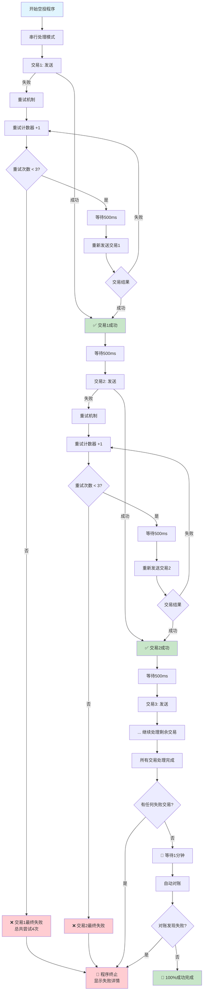

## 📋 串行重试机制说明

### 处理模式
- **执行方式**: 完全串行，一个接一个处理
- **并发数量**: 1个（无并发）
- **交易间延迟**: 500ms

### 重试机制
- **重试次数**: 每个交易最多3次重试（总共4次尝试机会）
- **重试间隔**: 500ms
- **触发条件**: 单个交易失败时立即重试
- **失败处理**: 任何交易最终失败，程序立即终止

### 最终检查
- **零容错**: 不接受任何失败交易，有失败立即终止程序
- **自动对账**: 所有交易成功后，等待1分钟进行区块链确认
- **对账失败**: 如果对账发现区块链上的交易失败，程序终止

### 成功率保障
- ✅ 每个交易最多有4次尝试机会
- ✅ 串行处理避免nonce冲突
- ✅ 固定延迟确保网络稳定
- ✅ 严格验证：程序宁可终止也不接受部分失败
- ✅ 100%成功率要求，零容错政策